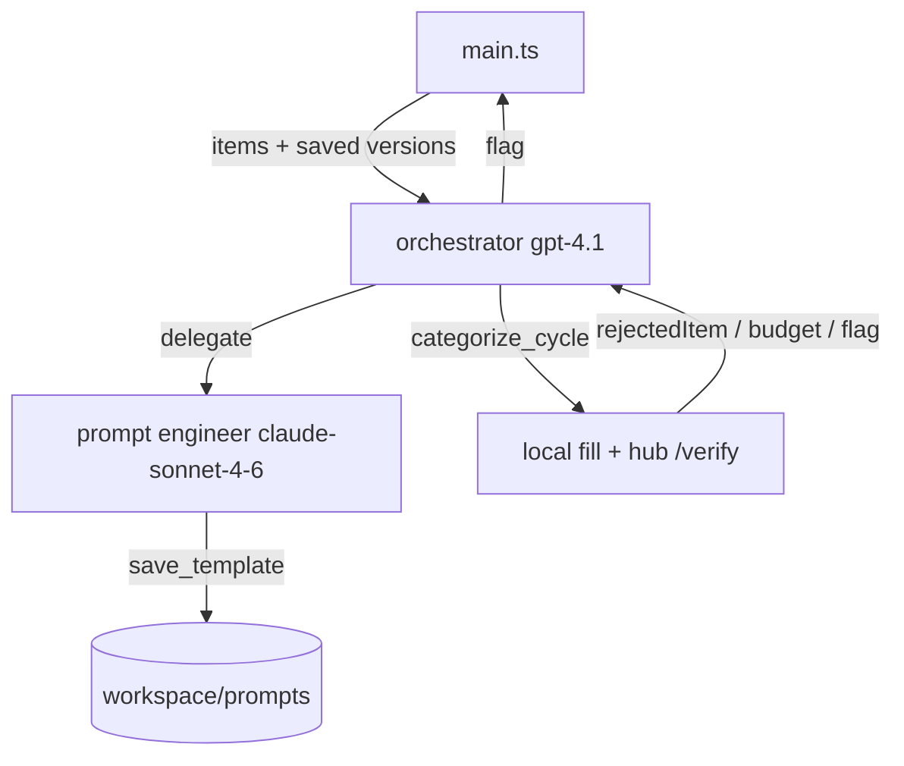

# S02E01 — categorize

Two agents produce a classifier template for the hub `categorize` task. After
`{id}` and `{description}` are substituted, the filled prompt must stay within
100 tokens; reactor-related shipments must be classified as `NEU` even when the
description sounds dangerous.

The lesson is about **prompt caching**, **context management**, **prompt
versioning** and **observability**. The runtime does not encode a
delegate-then-test sequence: it preloads the data both agents always need, then
lets the orchestrator choose the next tool call.

## Running

From the repository root:

```bash
npm run s02e01:install            # bun + lesson deps
npm run lessons:s02e01:op         # secrets from 1Password
npm run lessons:s02e01            # secrets already in the environment
```

Development and checks:

```bash
npm run lessons:s02e01:dev        # watch mode
npm run lessons:s02e01:test       # unit tests
npm run lessons:s02e01:typecheck  # tsc --noEmit
```

Optional JSONL run log (flushed on shutdown):

```bash
S02E01_RUN_LOG=1 npm run lessons:s02e01:op
```

## Environment

| Variable | Required | Purpose |
|---|---|---|
| `HUB_API_KEY` | yes | `categorize.csv` and `/verify` for the `categorize` task |
| `OPENAI_API_KEY` or `OPENROUTER_API_KEY` | yes | model access; see root `config.js` |
| `AI_PROVIDER` | no | `openai` or `openrouter`; required as `openrouter` when both keys are set |
| `LANGFUSE_PUBLIC_KEY` / `LANGFUSE_SECRET_KEY` | no | nested Langfuse traces (one run = one session) |
| `LANGFUSE_BASE_URL` | no | Langfuse host; default `https://cloud.langfuse.com` |
| `S02E01_RUN_LOG` | no | set to `1` to append events to `workspace/runs/<session>.jsonl` |

Models and USD prices are pinned in [src/config.ts](src/config.ts). Both agents
use the provider resolved by root `config.js`. The orchestrator is `gpt-4.1`;
the specialist is `anthropic/claude-sonnet-4-6`. That combination needs
OpenRouter: set `AI_PROVIDER=openrouter`, or leave only `OPENROUTER_API_KEY` in
the environment. If both keys are set and `AI_PROVIDER` is omitted, the root
config prefers OpenAI and the engineer model will fail.

## How a run proceeds



`main.ts` starts observability, downloads `categorize.csv`, lists saved prompt
versions, and puts both into the orchestrator's first message. The orchestrator
then decides when to delegate, inspect a stored template, or test one against
the hub. A run ends when a tool result carries a `{FLG:...}` flag, the round
budget is exhausted, or repeated tool failures trip the abort.

Both roles share [src/agent/loop.ts](src/agent/loop.ts). What differs is the
`AgentRole`: model, instructions, tools, round limit, and the completion
predicate (`flag` for the orchestrator, a successful `save_template` for the
engineer).

`categorize_cycle` downloads a fresh CSV, fills `{id}` and `{description}`
locally, and sends one finished prompt per item. It stops at the first
rejection, when the hub reports an exhausted PP budget, or when a flag comes
back. The per-item transcript never enters the model context: attempts go to
the console (and to JSONL when `S02E01_RUN_LOG=1`). Langfuse records the cycle
as a single tool span whose output is the summary — `rejectedItem`, counts,
budget — not a span per item.

## Tools

| Tool | Role | Purpose |
|---|---|---|
| `delegate` | orchestrator | Brief the specialist; returns a saved version |
| `categorize_cycle` | orchestrator | Test a template against the hub; optional PP reset |
| `prompt_versions` | orchestrator | `list` / `get` / `latest` stored templates and hub history |
| `save_template` | engineer | Validate placeholders and the 100-token limit, then persist |

A tool is declared once with `defineTool` and lists the roles allowed to call
it. Register it in `TOOLS`; `toolsFor(role)` and `runTool` pick it up. Access
control is the `roles` field, not a check inside the handler.

```ts
export const saveTemplateTool = defineTool({
  name: "save_template",
  description: "…",
  roles: ["engineer"],
  parameters: {
    type: "object",
    properties: { template: { type: "string" } },
    required: ["template"],
  },
  async run(args, ctx) { … },
});
```

Guard conditions — a missing `{id}` / `{description}`, a template over the
token limit, one already tested and rejected — return `{ ok: false, reason }`.
Only genuine faults throw, so the loop's failure budget is not consumed by
rules working as intended.

## Layout

| Path | Responsibility |
|---|---|
| [src/main.ts](src/main.ts) | wiring: clients, tool context, summary, flag |
| [src/config.ts](src/config.ts) | models, prices, round limits, paths |
| [src/agent/](src/agent) | shared loop and the two roles |
| [src/tools/](src/tools) | tool definitions and the role-aware registry |
| [src/hub/](src/hub) | CSV download, `/verify` client, test cycle |
| [src/prompts/](src/prompts) | instructions, token analysis, versioned store |
| [src/ai/](src/ai) | Responses API transport and conversation helpers |
| [src/observability/](src/observability) | events plus console, Langfuse and JSONL subscribers |
| [src/report/](src/report) | run summary, cost estimate, flag persistence |

`workspace/` is created at runtime and git-ignored:

- `workspace/prompts/vNNN/` — templates, token stats, hub run history
- `workspace/output/flags.json` — captured flags
- `workspace/runs/` — optional JSONL traces

## Observability

Console logging is always on. Langfuse and JSONL are opt-in. One run is one
Langfuse session. Observations open when work starts and close when it ends, so
an in-flight run is visible and a crash leaves an errored span instead of
nothing:

- `categorize-orchestrator` (agent) — the whole run; its output holds the flag,
  which is also set as the trace output so a run can be found by result.
- `root turn N` / `engineer turn N` (generation) — the rendered conversation,
  `usageDetails` with `input_cached_tokens`, and `costDetails` from the prices
  in `src/config.ts`.
- `delegate` (tool) — with `prompt-engineer` (agent) nested underneath it, so
  delegation reads as one subtree rather than two overlapping spans.
- `categorize_cycle` (tool) — hub test summary, including the rejected item
  when the cycle stops early.

Cached input tokens are the point of the lesson: the static part of a template
belongs at the front and `{id}` / `{description}` at the end. The run summary
prints the cached share per role; Langfuse shows the same number per
generation.

## Design notes

- Instructions describe the environment and the tools, not a script. Task facts
  (the current shipments, already-saved versions) are injected by `main.ts`.
- The orchestrator does not write templates. The engineer does not talk to the
  hub. That split is the `roles` field on each tool.
- Token counting uses the filled prompt, not the template with placeholders.
  The worst-case item decides whether a template is stored or tested.
- Identical templates that already failed a cycle are refused without another
  hub call.
- CSV download retries on 408/425/429/5xx. Classify and reset do not retry:
  repeating a `/verify` would spend PP a second time.
